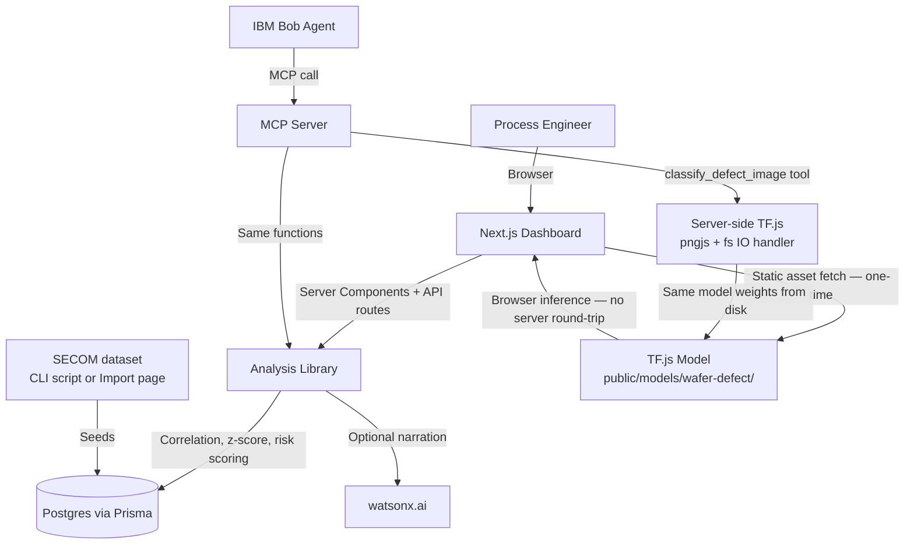

# Architecture

## System Architecture

## Components

| Component | Technology | Responsibility |
|---|---|---|
| Dashboard | Next.js 16 (App Router), shadcn/ui | Overview, Wafer Lots, Lot detail, Risk Watch, Check Batch, Import Dataset, Ask Bob chat |
| API routes | Next.js Route Handlers | Assistant chat, ad-hoc batch check, dataset import upload, manual analysis recompute |
| Analysis library | Plain TypeScript (`src/lib/analysis/`) | Correlation-based suspect sensor ranking, per-lot root cause ranking, risk scoring, yield trend — no ML dependency |
| Database | PostgreSQL via Prisma | `WaferLot`, `SuspectSensor`, `RootCauseFinding` — lot data, fab-wide correlation cache, per-lot cached findings |
| IBM Bob integration | MCP server (`src/mcp/server.ts`, `@modelcontextprotocol/sdk`) | Exposes `get_fab_overview`, `get_lot_root_causes`, `list_at_risk_batches`, `explain_lot`, `explain_risk`, `ask_bob` tools backed by the same analysis library |
| watsonx.ai | IBM watsonx.ai text generation (optional) | Turns computed root-cause/risk JSON into natural-language explanations; falls back to a templated summary if unconfigured |
| Dataset ingestion | `src/lib/secom/` + `scripts/import-secom.ts` | Parses SECOM-format feature/label files, seeds `WaferLot` rows, triggers analysis — shared by the CLI script and the Import Dataset page |

## Data Flow

1. Wafer lot data (sensor readings + pass/fail outcome) is loaded via `npm run import:secom` (reads the committed `data-raw/` files) or the dashboard's Import Dataset page (uploads a feature/label file pair).
2. Every 7th lot, by run order, is marked `UPCOMING` instead of `HISTORICAL` — its outcome is stored but withheld from analysis, simulating a batch flagged before it runs.
3. `computeSuspectSensors()` correlates every sensor's readings against `HISTORICAL` FAIL outcomes and caches the top ~25 in `SuspectSensor`.
4. Opening a lot's detail page (or a Bob `get_lot_root_causes` call) computes that lot's deviation from the healthy baseline on those suspect sensors, ranks by probability, and caches the result in `RootCauseFinding`.
5. `recomputeUpcomingBatchRisk()` scores every `UPCOMING` lot's deviation the same way, producing a 0–100 risk score shown on the Risk Watch page (with a retrospective accuracy check against the withheld real outcome).
6. The dashboard's "Ask Bob" chat and the MCP tools both call `src/lib/assistant.ts`, which pulls the same computed data and either forwards it to watsonx.ai for narration or falls back to a template.
7. The "Check a Batch" page runs the same root-cause/risk computation on-demand against a pasted raw reading line, without needing to seed it as a lot first.

## Security Considerations

- No authentication exists in this build — it's a single-engineer demo tool, not multi-tenant; deploying it for real fab use would need an auth layer before exposing it beyond localhost.
- Database credentials and watsonx.ai keys are read from environment variables (`.env`, gitignored) and never committed; `.env.example` documents every variable with dummy values.
- The Import Dataset page requires an explicit checkbox acknowledgement before replacing existing data, since the operation is destructive and irreversible.
- Uploaded dataset files are validated (row-count match, minimum sensor-column count) before any existing data is deleted, so a malformed upload fails without touching the database.

## Scalability Notes

The analysis functions currently load the full historical lot population into memory to compute correlations — fine at SECOM's scale (1567 lots × 590 sensors) but would need to move to SQL-side aggregation or incremental/streaming correlation updates for a fab running continuous, much larger lot volumes. The Next.js app is stateless and could be horizontally scaled behind a load balancer; Postgres would be the first bottleneck to address (read replicas, or pre-aggregating suspect-sensor correlations on a schedule rather than recomputing from raw rows).
